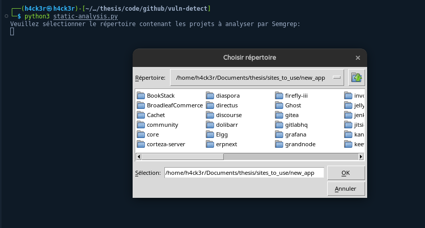
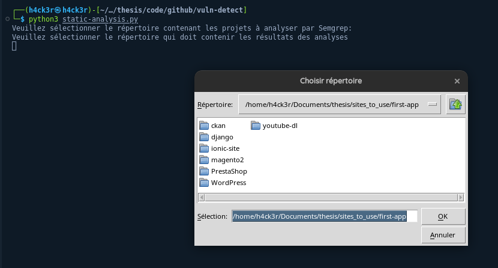
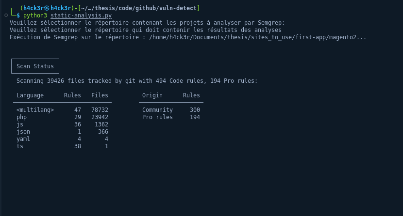
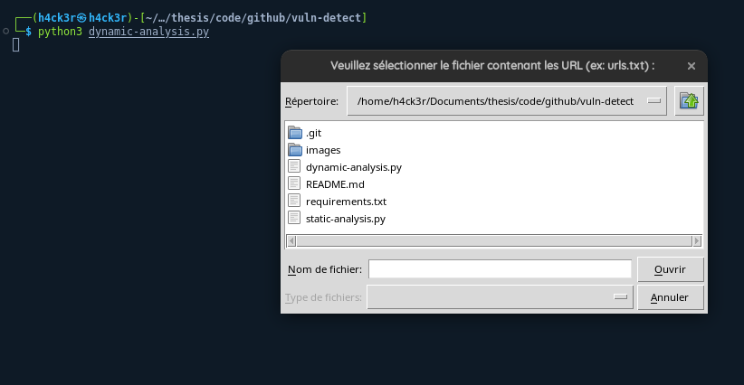
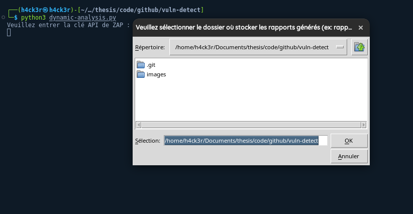
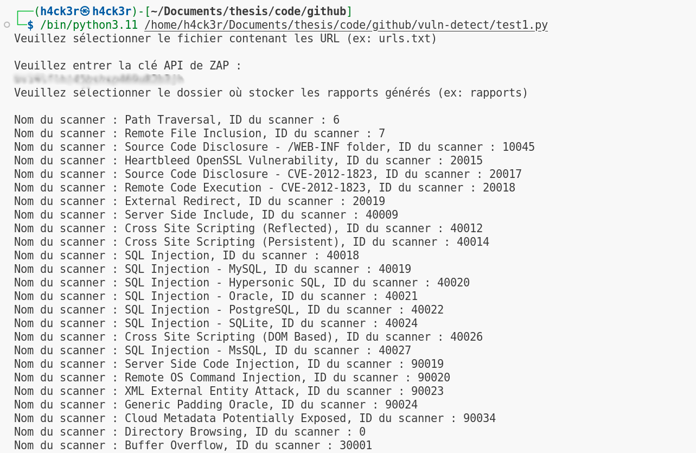
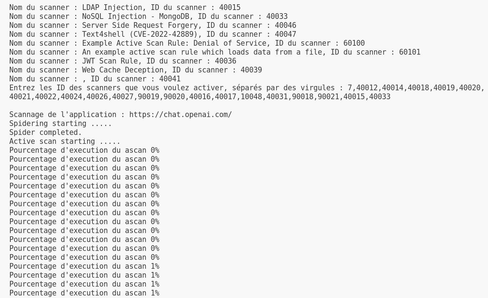
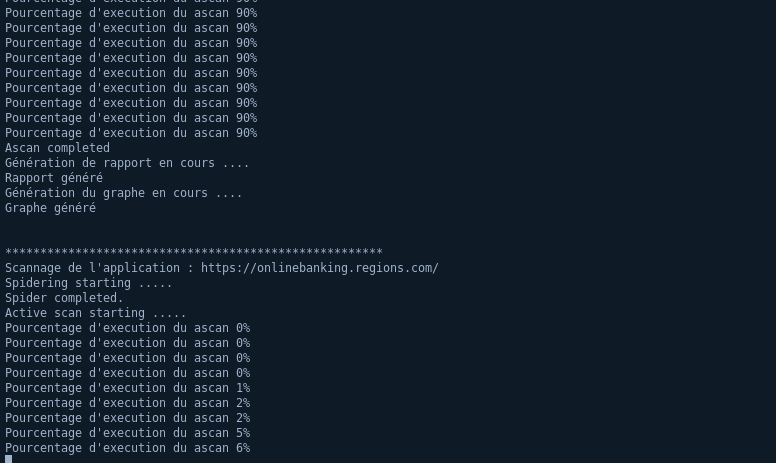

# vuln-detect
Web application injection vulnerability detection framework
This project focuses on detecting injection type vulnerabilities in web applications, whether in production or under development.
# Introduction
The project includes two scripts: static-analysis.py and dynamic-analysis.py. This README.md file explains how to use them and provides an overview of how they work.

# Prerequisites
`pip install -r requirements.txt`

This command is essential for the proper functioning of the framework.

## Installation of tkinter

If you're having problems running any of these scripts due to a lack of tkinter, you can install the module by following the instructions below:

### For Python 3.x :

#### On Windows and macOS :

tkinter is usually included with Python and does not require a separate installation.
#### On Linux :

Install tkinter using your distribution's package manager. For example, for Debian-based distributions (like Ubuntu), you can use the following command:

`sudo apt-get install python3-tk`

### For Python 2.x :

#### On Windows and macOS :

tkinter is usually included with Python and does not require a separate installation.

#### On Linux :

Install tkinter using your distribution's package manager. For example, for Debian-based distributions (like Ubuntu), you can use the following command:

`sudo apt-get install python-tk`

_______________________________________________________________________

## static-analysis.py
The static-analysis.py script uses Semgrep to perform static analysis of projects. It allows you to analyze folders containing projects and generate an detailled HTML report listing all injection detected errors.

### Instructions for use
1. Run the script with the following command: `python static-analysis.py`
2. Select the directory containing the projects to analyze
3. Select the analysis rules (in the recup_semgrep_rules > injection_rules folder)
4. Select the output directory for the generated HTML files

### Example of execution

## dynamic-analysis.py
The dynamic-analysis.py script uses ZAP to perform a dynamic analysis of web applications. It allows you to scan multiple applications from a file containing a list of URLs, generate an HTML report for each application, and generate a chart showing the number of alerts by risk level.

### Instructions for use
1. Run the script with the following command: `python dynamic-analysis.py`
2. Select the file containing the URLs of the applications to scan
3. Enter the ZAP API key
4. Select the output directory for the generated HTML files
5. Select the output directory for the generated chart images
6. Choose the scanners for injection

### Example of execution
 
 
 
 
 

