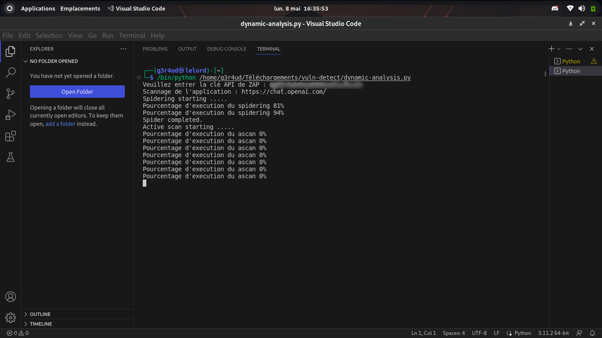
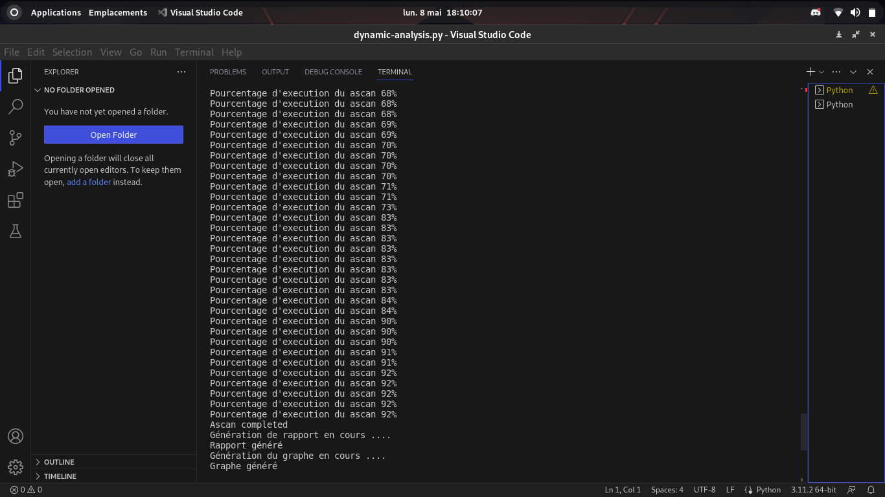

# vuln-detect
Framework de détection des vulnérabilités de type injection dans les applications web
Ce  projet est axé sur la détection des vulnérabilités de type injection dans une application web en pré-production ou post-production.
# Introduction
Le projet comprend deux scripts: static-analysis.py et dynamic-analysis.py. Ce fichier README.md explique comment les utiliser et donne un aperçu de leur fonctionnement.

# Pré-requis
`pip install -r requirements.txt`

Cette commande est primodiale pour le bon fonctionnement du framework.

## Installation de tkinter

Si vous rencontrez des problèmes pour exécuter l'un de ces scripts en raison de l'absence de tkinter, vous pouvez installer le module en suivant les instructions ci-dessous :

### Pour Python 3.x :

#### Sous Windows et macOS :

tkinter est généralement inclus avec Python et ne nécessite pas d'installation séparée.

#### Sous Linux :

Installez tkinter en utilisant le gestionnaire de paquets de votre distribution. Par exemple, pour les distributions basées sur Debian (comme Ubuntu), vous pouvez utiliser la commande suivante :

`sudo apt-get install python3-tk`

### Pour Python 2.x :

#### Sous Windows et macOS :

tkinter est généralement inclus avec Python et ne nécessite pas d'installation séparée.

#### Sous Linux :

Installez tkinter en utilisant le gestionnaire de paquets de votre distribution. Par exemple, pour les distributions basées sur Debian (comme Ubuntu), vous pouvez utiliser la commande suivante :

`sudo apt-get install python-tk`

_______________________________________________________________________

## static-analysis.py
Le script static-analysis.py utilise Semgrep pour effectuer une analyse statique des projets. Il permet d'analyser des dossiers contenant des projets et de générer un rapport HTML contenant toutes les erreurs détectées.

### Instructions d'utilisation
1. Exécuter le script avec la commande suivante: `python static-analysis.py`
2. Sélectionner le répertoire contenant les projets à analyser
3. Sélectionner le répertoire de sortie pour les fichiers HTML générés

### Exemple d'exécution

## dynamic-analysis.py
Le script dynamic-analysis.py utilise ZAP pour effectuer une analyse dynamique des applications web. Il permet de scanner plusieurs applications à partir d'un fichier contenant une liste d'URL, de générer un rapport HTML pour chaque application et de générer un graphique montrant le nombre d'alertes par niveau de risque.

### Instructions d'utilisation
1. Exécuter le script avec la commande suivante: `python dynamic-analysis.py`
2. Sélectionner le fichier contenant les URL des applications à scanner
3. Entrer la clé API de ZAP
4. Sélectionner le répertoire de sortie pour les fichiers HTML générés
5. Sélectionner le répertoire de sortie pour les images des graphiques générés

### Exemple d'exécution
 
 

